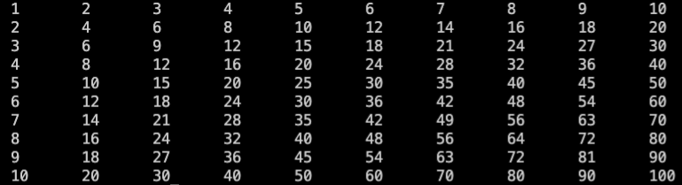

# 404B Lesson 2 Assignment 2A

## Pre-requisites

You must know how to:

- show message in console window.
- create loop with `for` and `range`
- use nested loop

## Instructions

### Split VS Code Window

You can drag `main.py` tab to the right side of the window to split the window into two panes. This will allow you to see the instructions and the code at the same time.

### Answering

You can answer the questions by writing your answers in the `main.py` file.

You can run the code by clicking the `Run` button on the top right corner of the editor.

The output will be shown in the `Terminal` tab at the bottom of the editor.

## Your Task

Write a program that produces the multiplication table as below:
  

## Hints

- You may use `print('msg', end='\t')` to add separation between numbers in the same row.
- `\t` will adds separation as pressing a TAB key.

- Example:

    ```python
    print('1', end='\t')
    print('2', end='\t')
    print('3', end='\t')
    print('stop')
    
    # Will output:
    1       2       3       stop
    ```
